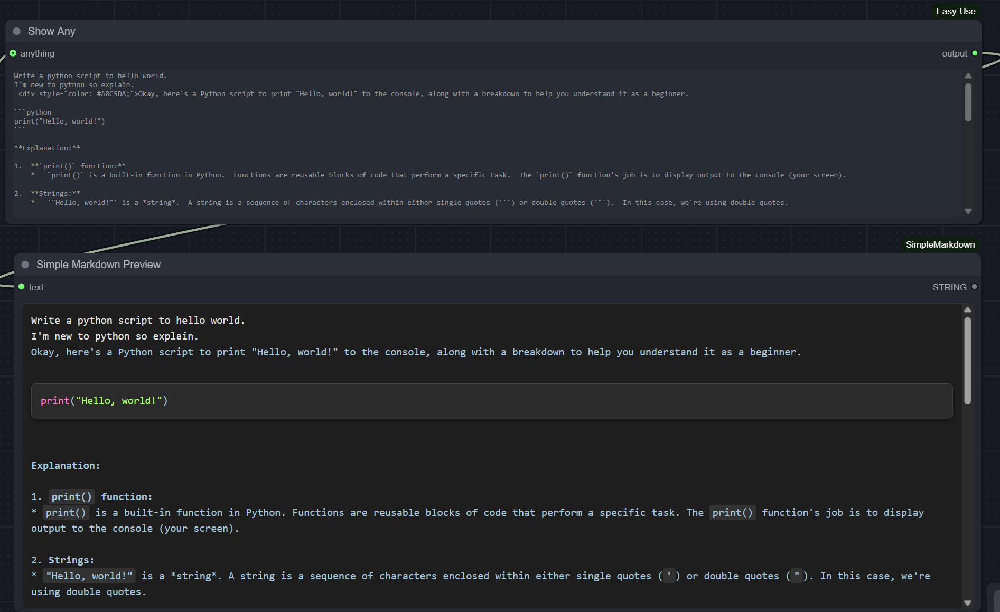

# Simple Markdown Preview for ComfyUI

A lightweight, stable markdown preview node for ComfyUI with syntax highlighting and proper formatting.



## Features

- Stable Rendering - No widget recreation issues, works reliably in loops
- Syntax Highlighting - Python code blocks with color-coded syntax
- Markdown Support - Headers, bold text, lists, inline code
- Proper Spacing - Automatic indentation normalization and line break preservation
- Custom HTML Tags - Supports color div tags for custom styling
- Resizable Widget - Adjusts to node size

## Installation

### Via ComfyUI Manager
1. Open ComfyUI Manager
2. Search for "Simple Markdown Preview"
3. Click Install

### Manual Installation
1. Navigate to your ComfyUI custom_nodes folder
2. Clone this repository:
   ```bash
   git clone https://github.com/Mohamed-Sakr/ComfyUI-SimpleMarkdown
   ```
3. Restart ComfyUI

## Usage

1. Add the Simple Markdown Preview node to your workflow
2. Connect any string output to the text input
3. The node will display formatted markdown with syntax highlighting

## License

MIT License - See LICENSE file for details
